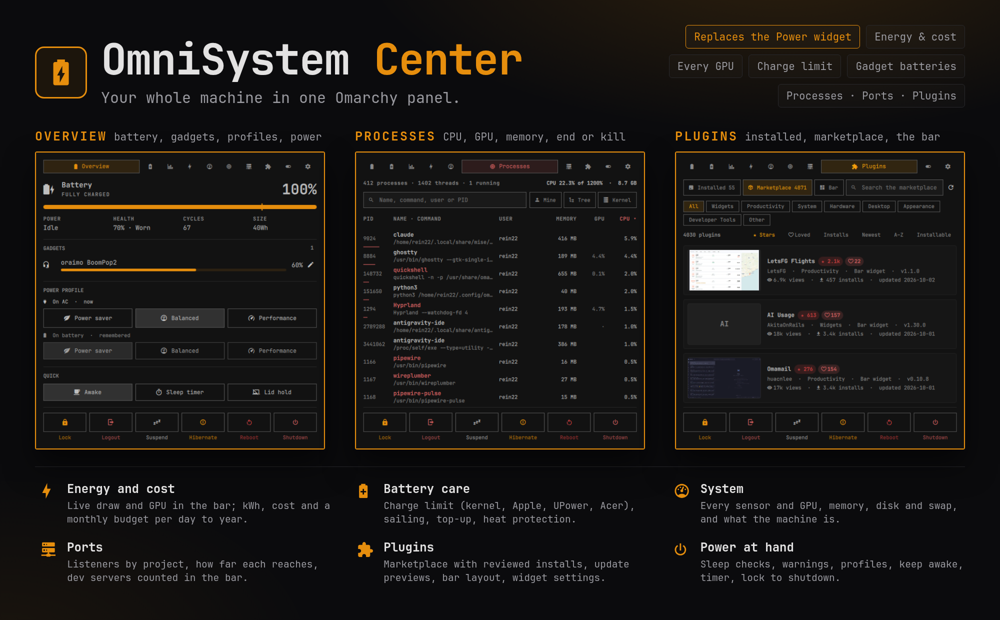

# OmniSystem Center

Your machine in one Omarchy bar widget. It began as the battery and power
widget and grew into a control centre: the battery and its care, what the
machine draws and what that costs per day, week, month and year, every
sensor and GPU, the processes (end, kill, pause, renice, per-process GPU),
what listens on which port and for which project, every Omarchy plugin
(switch, update with a preview of what changes, remove, install the reviewed
commit from the marketplace, arrange the bar, edit another widget's
settings), the batteries of your mouse, keyboard, headset and earbuds, keep
awake and a sleep timer, and lock, logout, suspend, hibernate, reboot and
shutdown at the bottom of every tab.

It works out what your machine can do and shows only that: a laptop whose
firmware lets it cap the charge gets a charge limit, sailing mode, top-up and
heat protection; one that cannot gets an unplug reminder instead. A desktop
gets its gadgets first and no battery section at all.



OmniSystem Center replaces Omarchy's built-in **Power** widget, so it sits
where that one was and answers the same `omarchy.power` commands. Disable it
and the built-in widget comes back.

## Features

| Tab | What it does |
|---|---|
| **Overview** | The battery: level, state, time left or to full, power in or out, health, cycles, size, temperature and drain rate (where reported). Gadget batteries, renamable, with their vendor app a click away. A power profile for AC and one for battery, either one chosen from here. Quick switches for keep awake, the sleep timer and lid hold |
| **Care** | Charge limit (exact, 50–100%), sailing mode, charge to 100% once, calibration, heat protection, or an unplug reminder where the hardware has no limit; the warning levels and the critical action; taking over Omarchy's own battery warning |
| **Insights** | Health against the design capacity and how fast it wears, the last six hours as a graph, the last seven days on battery, sessions on battery, tips, and a Markdown report to save or copy |
| **Energy** | What the machine draws now at the socket, split into CPU, GPU and the rest, with how much of it is measured. Energy and cost per day, week, month, year or any number of days, as a graph you can hover and as a list with how much of each period was tracked. Price, currency and the estimates are set right there, and calibrating against a wall meter takes one field. See [docs/energy-meter.md](docs/energy-meter.md) |
| **System** | CPU (with clock), memory, CPU temperature, CPU package power and battery draw as small graphs; load, fastest core, disk space, every GPU and swap/zram; every temperature and fan sensor; the processor (model, clock range, caches, scaling driver, governor and energy preference), memory and storage (disk model, file system, encryption), the device (model, board, firmware and EC, Omarchy version, kernel, battery model), and the graphics, network, audio and USB hardware. Click any fact to copy it, or copy everything at once. Sampled only while the tab is open |
| **Processes** | Every process, like btop: PID, name and command, user, memory, GPU (the kernel's per-client counters for Intel, AMD and the like; NVML for NVIDIA while the card is awake) and CPU (the share of one core since the last sample), sortable by any column, searchable, only yours or all, as a list or a tree. Open one for its state, uptime, threads, priority, parent, memory, disk I/O, open files, folder and program, then End, Kill, Pause or Resume, Interrupt, Reload (SIGHUP), lower its priority or copy its command. End tree and Kill tree take a process and everything it started, children first. Ending and killing take two clicks; processes the desktop session needs are marked and warned about |
| **Ports** | What listens on this machine, named by the project that runs it (`5173 · Vite` in `my-app`, not `node`), with how far each port reaches (this machine, containers, VPN, the network). Dev / mine / exposed / all, grouped by project; open in the browser, copy the address, open a terminal in the project, stop or force-kill (two clicks), or stop a Docker/Podman container. Sockets of root are named from about 100 well-known ports, marked as a guess |
| **Plugins** | Installed Omarchy plugins: on/off switch, update (with a git check of every plugin's remote), remove (third-party only), folder, commit and local edits, repository and marketplace page. The marketplace: all of plugins.omarchy.org with previews, stars, verified marks, categories, sorting and search; install with a warning when the repository changed since its review. Every change runs through `omarchy plugin`. **Bar**: the bar as laid out, left, centre and right, to reorder or move a widget to another section, and the enabled widgets that are in none. Installed plugins with a settings list get **Bar settings**, written with `omarchy bar set`; an update shows **What's new** (its commits and files, from GitHub) first; Install takes the commit the marketplace reviewed and verifies it before enabling |
| **Settings** | Every setting of the widget in one place, grouped (bar, panel and tabs, battery and warnings, gadgets, ports), each with what it does, built from the manifest so nothing is missing; a link to the energy meter's price and estimates |
| **Controls** | Keep awake, sleep timer (suspend, hibernate or shut down after 15 minutes to 2 hours, survives a shell restart), lid hold, keyboard backlight per power source |

Under every tab: **Lock**, **Logout**, **Suspend**, **Hibernate**, **Reboot**
and **Shutdown**. Logout, reboot and shutdown ask first; suspend and hibernate
appear only when they are available.

On a laptop the battery comes first and the gadgets sit in the middle; on a
desktop the gadgets lead. The bar icon is the battery on a laptop, and on a
desktop the gadget with the least charge (or the power symbol). Beside it is
what the machine draws, and a GPU icon with its draw while a discrete GPU is
awake (a sleeping GPU shows nothing), integrated graphics as a chip with its
usage if you like, and a port icon with the number of dev servers running
(with a warning mark while one is open to the network). It turns red when the
battery is low, or when the draw passes a level you choose.

### What appears on which machine

| Feature | Shown when |
|---|---|
| Charge limit, sailing, top-up, calibration | The kernel's `charge_control_end_threshold` (and `_start_` for sailing) or the Apple SMC limit is writable by your user, or UPower reports charge-threshold support |
| Unplug reminder | There is no limit the system may set |
| Heat protection | The battery reports a temperature |
| Hibernate | Hibernation is set up (`omarchy-hibernation-setup`) |
| Suspend | Not turned off in Omarchy's system menu |
| Lid hold | The machine has a lid |
| Keyboard backlight | A keyboard backlight LED exists |
| CPU power, energy on AC | The RAPL energy counter is readable (see [docs/energy-meter.md](docs/energy-meter.md)); on battery the energy meter needs nothing |
| GPU in the bar | A discrete GPU (NVIDIA, AMD or Intel Arc) is awake |
| Gadgets | Any source below reports one |

OmniSystem Center never asks for more rights than your session has. When a
laptop's limit files belong to root, the Care tab says so and
`docs/charge-limit.md` shows a one-time rule that hands them to your user.

## Requirements and dependencies

Everything it needs ships with Omarchy: UPower, power-profiles-daemon,
logind, `brightnessctl`, `notify-send` and Omarchy's own `omarchy-*`
commands. Python 3 runs the probe and the gadget collectors.

Optional, used when present:

| Tool | For |
|---|---|
| `headsetcontrol` | USB and 2.4 GHz headsets (Logitech G, SteelSeries, HyperX, Corsair, …) |
| `solaar` | Logitech HID++ levels that stay right on the charging cable, and opening Solaar from the row |
| Omarchy Buds + GalaxyBudsClient | Galaxy Buds per earbud and case |
| `python-dbus`, `python-gobject` (ship with Omarchy) | AirPods and Google Fast Pair earbuds (Sony, JBL, Jabra, Nothing, Soundcore, Pixel Buds) per earbud and case |
| `wl-copy` | Copying the report and system facts |
| NVIDIA driver (`libnvidia-ml`) | NVIDIA GPU power |
| `btop` | The **btop** button on the System tab |

## Install

```bash
omarchy plugin add https://github.com/gameticharles/omnisystem-center --enable
```

## Usage

Click the battery in the bar. **Right-click** steps through what is shown
beside the icon: the draw, the charge and the draw, the charge, today's
energy, nothing.

Keys in the panel: `1`–`9` or `[` `]` switch tabs, `a` toggles keep awake,
`L` locks, `S` suspends, `R` reboots and `P` powers off (the last two ask
first), `Esc` closes. On the list tabs `j` `k` (or the arrows) move a
cursor, `Enter` opens it, `/` searches, and:

| Tab | Keys |
|---|---|
| Processes | `x` end, `X` kill (each twice), `p` pause or resume, `c` copy the command, `t` tree, `m` only mine |
| Ports | `o` open, `y` copy the address, `c` copy the command, `t` terminal there, `x` stop, `X` kill (each twice), `f` next filter |
| Plugins | `v` Installed / Marketplace / Bar; `e` on or off, `u` update, `d` remove (twice); `i` install (twice), `p` the preview large; in Bar, `J` `K` move the widget |

### Battery care

Lithium batteries age fastest when they sit full, hot or both. If your
laptop stays plugged in most of the day, a limit around 80% keeps it going
for years longer:

- **Limit charging** stops at the level you pick.
- **Sailing mode** lets the charge drift down to a lower level before it
  charges again, instead of topping up every small dip.
- **Charge to 100% once** before a trip; the limit comes back when you unplug
  after the full charge, or after a day.
- **Heat protection** pauses charging while the battery is hot and resumes
  once it cools (or warns you, where charging cannot be paused).
- **Calibrate** every few months: charge to 100%, rest an hour, run down to
  15%, charge back. Notifications tell you when to plug in and out.

OmniSystem Center writes a limit only after you use one of these controls, so
a limit set by your firmware or another tool is left alone until then.

### Warnings and the critical action

At the low level (10% by default) it sends Omarchy's own low battery
notification and runs your `battery-low` hooks. At the critical level (5%) it
counts down 60 seconds and then hibernates, or suspends when hibernation is
not set up. Plugging in or pressing **Cancel** on the notification or in the
panel stops it.

Omarchy's own Battery service sends a fixed 10% warning. While it is on,
OmniSystem Center leaves the low warning and the plug-in profile switch to it
so nothing is sent twice; **Take over** on the Care tab turns it off and
**Give warnings back to Omarchy** turns it on again.

### From the terminal or a key binding

```bash
omarchy-shell omnisystem-center toggle
omarchy-shell omnisystem-center show care
omarchy-shell omnisystem-center status
omarchy-shell omnisystem-center action suspend
omarchy-shell omnisystem-center sleepTimer 30 shutdown
omarchy-shell omnisystem-center cancelTimer
omarchy-shell omnisystem-center keepAwake toggle
omarchy-shell omnisystem-center profile power-saver
omarchy-shell omnisystem-center topUp
omarchy-shell omnisystem-center report
omarchy-shell omnisystem-center togglePercentage
omarchy-shell omnisystem-center cycleLabel
omarchy-shell omnisystem-center energy
omarchy-shell omnisystem-center energySettings
omarchy-shell omnisystem-center energyPeriod week
```

`status` prints JSON with the battery, the energy meter, the charge limit,
the profile, keep awake, the sleep timer and the gadgets; `energy` only the
draw, the GPU, and today's and this month's energy and cost. Bindings written for the built-in
widget (`omarchy-shell omarchy.power toggle`) keep working.

## Configure

Settings live on the widget's entry in `~/.config/omarchy/shell.json` and in
Omarchy's widget settings:

| Setting | Default | Meaning |
|---|---|---|
| `barLabel` | `draw` | The value beside the icon: `draw` (the whole machine), `watts` (in or out of the battery), `today` (kWh), `cost` (today's cost) or `none` |
| `showPercentage` | `true` | The battery percentage beside the icon |
| `barGpu` | `discrete` | `discrete`, `integrated`, `both` or `off`: GPUs in the bar |
| `barGpuValue` | `usage` | `usage`, `watts` or `both` |
| `barPorts` | `true` | A port icon and the number of dev servers (0 too), red while any run; click it for the Ports tab. Also switchable on the Ports tab |
| `panelWidth` | `comfortable` | `compact` 460 px, `comfortable` 560 px, `wide` 680 px |
| `startTab` | `last` | The tab the panel opens on; `last` reopens the one you left, where you left it |
| `lowLevel` | `10` | Low battery warning level, 0 for off |
| `criticalLevel` | `5` | Critical level, 0 for off |
| `criticalAction` | `hibernate` | `hibernate` (falls back to suspend), `suspend` or `none` |
| `lowBatteryProfile` | `20` | Switch to power saver on battery at this level, 0 for off |
| `autoProfiles` | `true` | Apply the profile remembered for AC or battery on plug events |
| `gadgetLowLevel` | `15` | Gadget low battery notification, 0 for off |
| `gadgetFullAlert` | `true` | Tell you when a charging gadget reaches 100% |
| `externalPath` | `""` | External gadget JSON file (default `~/.cache/omarchy-accessories/external.json`) |
| `names` | `{}` | Gadget renames, `{"Reported name": "Your name"}` |
| `systemMonitor` | `true` | Show the System tab |
| `notifications` | `true` | Care, sleep timer and calibration notes (warnings are always sent) |
| `energyMeter` | `true` | Record energy and cost, show the Energy tab and the draw |
| `highWattThreshold` | `0` | Turn the icon red at this draw in watts, 0 for off |
| `processesTab`, `portsTab`, `pluginsTab` | `true` | Show those tabs |
| `portWatch` | `true` | Notify when a dev server of yours becomes reachable from the network |

Care settings, the sleep timer, history and renames made in the panel are
kept in `~/.local/state/omnisystem-center/state.json`. The energy history is
in `energy.db` next to it, and the price and estimates in
`~/.config/omnisystem-center/energy.json`.

### Your own gadget scripts

Executable scripts in `~/.config/omarchy/omnisystem-center/collectors.d/`
(and Gadget Batteries' `~/.config/omarchy/gadget-batteries/collectors.d/`)
run once a minute. Each prints a JSON list of
`{"name": "…", "kind": "mouse", "level": 80, "charging": false}`.

## Remove

```bash
omarchy plugin remove omnisystem-center
```

Omarchy's Power widget comes back in its place. If you let OmniSystem Center
take over the battery warnings, turn Omarchy's service back on with
`omarchy plugin enable omarchy.battery` (or **Give warnings back to Omarchy**
before removing). A charge limit you set stays in the firmware until you
change it; set the limit to 100% first if you want it gone.

## How it works

One service holds all state and runs once, however many monitors (and bars)
you have; the bar widgets only draw it. `bin/omnisystem-center-probe` reports
what the hardware offers as JSON (battery files, threshold files and whether
they are writable, UPower's charge-threshold properties, the keyboard LED,
the lid), samples CPU, memory, disk, temperatures and fans for the System
tab, and describes the machine from sysfs and hwdata's PCI names (it never
reads a device's configuration space, which would wake a sleeping GPU).
`bin/omnisystem-center-energy` is the energy meter: the shell starts it and it
stops with the shell, samples every 10 s into SQLite, and answers the Energy
tab.
`bin/omnisystem-center-ctl` makes the only writes outside the plugin's state:
the charge limit, through files your user may already write or UPower's
D-Bus method, every value checked first. Lid hold is a logind inhibitor that
lasts as long as the switch is on. `docs/ARCHITECTURE.md` has the details.

## Moving from other battery plugins

OmniSystem Center covers Omarchy's Power widget and Battery service, Power
Menu, Gadget Batteries, PowerCore, Power Monitor, Power Manager, AlDente,
Energy Meter and System Information.
Disable those to avoid two icons and two sets of notifications. Gadget
Batteries' collector scripts keep working without changes. Energy Meter keeps
its own history; OmniSystem Center starts a new one, and the two can run side
by side while you compare them.

## Troubleshooting

- **No charge limit:** the Care tab names the reason. "Root only" means the
  kernel has a limit but your user may not set it; see `docs/charge-limit.md`.
- **A gadget is missing:** it has to report a level through one of the
  sources above; wired and 2.4 GHz headsets need `headsetcontrol`, and a
  Logitech device on its cable reads best through `solaar`.
- **The Energy tab says AC time is not recorded:** the CPU energy counter is
  root-only; [docs/energy-meter.md](docs/energy-meter.md) has the one-time
  read-only rule. Time on battery is recorded either way.
- **Energy looks too high or too low on AC:** calibrate the estimate against
  a wall meter on the Energy tab's settings; the whole history follows.
- **The GPU icon stays in the bar:** the discrete GPU is awake, which costs
  power even at 0% busy. Something is using it (an external monitor, a game,
  a browser set to use it). The tooltip shows its draw and how busy it is.
- **Suspend or hibernate does not come back:** the Controls and Care tabs
  say why when they can tell (an NVIDIA driver keeping video memory over
  sleep without its sleep services, no resume target); see
  [docs/sleep.md](docs/sleep.md).
- **A dev server is not counted as one:** use the dev button on its row on
  the Ports tab (the program then counts on any port), or add the port to
  `devPorts` in Settings.
- **The panel says the service is not running:** `omarchy restart shell`.

## Development

```bash
scripts/check.sh        # unit tests, script tests, manifest validation, lint
scripts/dev-sync.sh     # copy into ~/.config/omarchy/plugins and restart
```

## Credits

Built on Omarchy's Power widget and Battery service, with Power Menu by
BlackCode, Gadget Batteries by 69Harold69 (with Jacek Becela's Fast Pair
reader), and ideas from PowerCore by Greg DeYoung, Power Monitor by Kinara
Jongga Varga, Power Manager by OnlyVishesh and AlDente for Omarchy by
monkonthehill, Energy Meter by Kevin Zakaria, SysProcess Manager, Plugin
Depot, Plugin Manager, Plugin Control Center, Top Bar Plugin Manager,
Omaports, Ports, Portside and Port Manager (and btop for the process view).
All MIT; see NOTICE. The
device sections of the System tab follow the feature list of System
Information by Fred (GPL-3.0); no code from it is used.

## License

MIT, see LICENSE.
